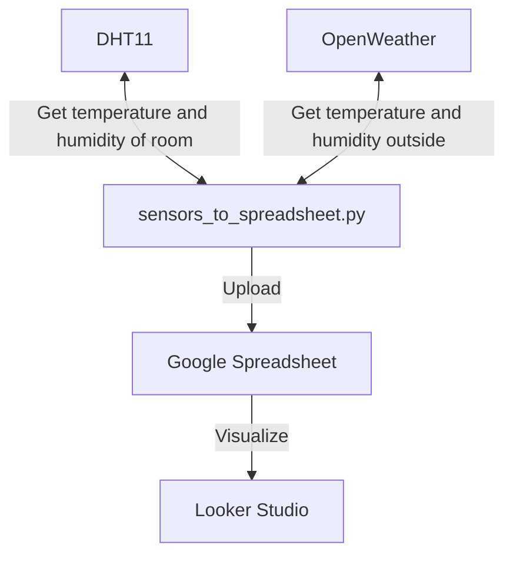

<p>


</p>

# lab-sensor<!-- TODO 書く -->
Raspberry Pi に接続した温湿度センサー（DHT11）からのデータをGoogle Spreadsheet にアップロードするPythonコードです。
cron による定期実行を行い、Looker Studioを用いて可視化を行なっています。

# DEMO


# Features
<!-- By specifying the ID on Google Drive, the photos will be overwritten. This ensures there is no worry about consuming too much storage space.

Google Drive上のidを指定することで写真を上書きします。容量を圧迫する心配がないです。 -->
ファイル構成は以下のようになっています。
```bash
.
├── config.ini
├── Data/
│   ├── DHT11/
│   └── OpenWeather/
├── DeviceList.csv
├── DHT11.py
├── .env
├── Freenove_DHT.py
├── Log/
├── openweather.py
├── .python-version
├── README.md
└── sensors_to_spreadsheet.py
```

# Requirement

<!-- * Python 3.9.2
* python-dotenv 1.0.1 (Additional) -->

# Installation
<!-- 
Install PyDrive (and python-dotenv) with pip command.

pipコマンドでPyDrive(、python-dotenv)をインストールしてください。

```bash
pip３ install PyDrive
pip3 install python-dotenv
``` -->

# Usage
<!-- 
Clone the repository and Run "main.py" in the directory.

リポジトリをクローンし、ディレクトリ内にある"main.py"を実行してください。

```bash
git clone https://github.com/daikidaiku/upload-lab-photo
cd upload-lab-photo
python3 main.py
``` -->

# Note

<!-- Since authentication is required for the first time, please use a smartphone or other device to authenticate as needed.

初回は認証が必要となるため、適宜スマートフォン等を利用し認証してください。 -->

# Author

* daiki_daiku
* Waseda University
* Twitter : https://twitter.com/daiki_da1ku

# License

upload-lab-photo is under [MIT license](https://en.wikipedia.org/wiki/MIT_License).